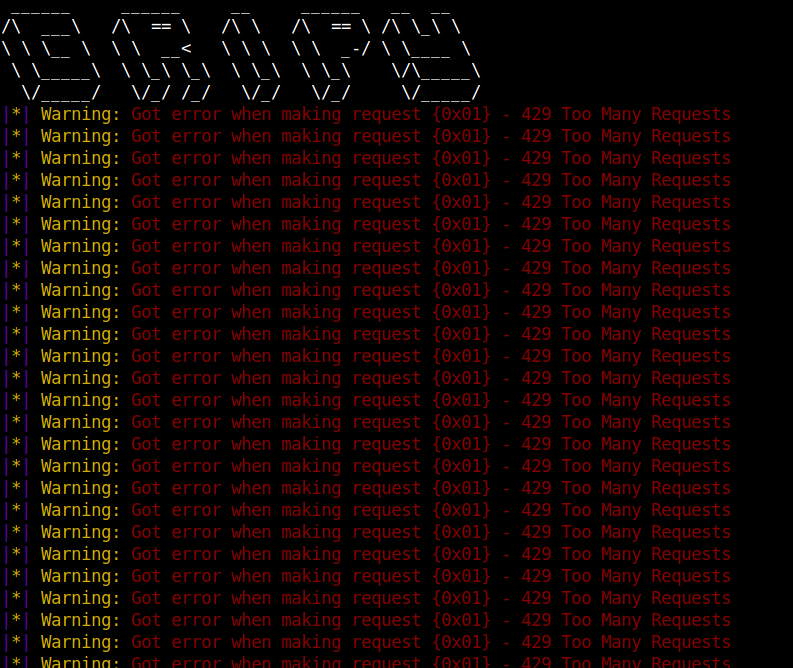

# install and run command

`sudo apt-get install golang ; git clone https://www.github.com/ArkAngeL43/Grippy.git ; cd Grippy ; go get github.com/spf13/pflag ; go build . ; ./main --help`

# What is it 

grippy is a rip off of a personal engine i use to scrape google for days and days on end for things such as files, video formats, vulnerable servers and whatever i can think of. Recently i made my entire DB of books open to the public for a whole day and let people select files, well today i decided why not make a smaller more open sourced version of the engine i use day to day. Grippy is a search engine that searches for a certian file perfix and will download them to a given output file. For example if you were looking for books you can use a query such as `RTFM filetype:pdf` and the engine will search google for however long you tell it and when its done it will make a request to every single URL and decipher which URL is worth making the request to by matching the opted file prefix you are looking for within the URL. for example if you are searching for the following file prefix

`*.pdf` and have the query `RTFM filetype:pdf` Grippy will search google, collect URL's, Save them to a JSOn file, and parse each and every one of them and see if the URL has the end extension `.pdf` if it does like the following `https://www.someurl.com/filetype.pdf` then it will download it to a given directory, if else it will trash the URL and not save the file. Using file and signature based verification gripper is easily able to filter out whats good and whats bad

# features 

* You can drop a list of queries 
* Scrapes google based on a signature 
* fast 
* Simple 


### Commands and flags and general usage ###

```
Flag options:
			--format/-f  | This will set the file format, which will be the file extension you are dorking for, for example (*.pdf)
						  This FLAG MUST HAVE THE PREFIX *. BEFORE THE EXTENSION THIS IS REQUIRED
				
			--verbose/-v | This sets verbosity to true or false, do you want large output if so use it if not dont

			
			--output/-o  | This will set the output directory of all downloaded files this is REQUIRED

			
			--query/-q   | This will set the google dorking query, this is REQUIRED

			
			--results/-r | This will set the amount of results per page, for example for every one page you want to output 5 links you would use --results=5


			--pages/-p   | This will set the amount of pages you want to search, for example if you want 100 pages use --pages=100

			--listp/-t   | This is an option if you want to use a list of queries, this would be the file to the query list / dork list

			--list/-l    | This is an option that NEEDS to be set BEFORE you use --listp example (--list --listp="filepath to dorks")
		

			==========================================================================================================================

			Example usage;

			Normal        1: 			go run main.go --format=(*.pdf) --verbose --output="/home/user/Desktop/File" --query="BTFM filetype:pdf" 
			File of dorks 2:            go run main.go --format=(*.doc) --verbose --output="/home/user/Desktop/File" --list --listp="/home/fileofdorks.txt"
			Results       3:            go run main.go --format=(*.pdf) --verbose --output="/home/user/Desktop/File" --query="BTFM filetype:pdf" --results=900 --pages=1000

```

# note 

If you set the page count to high or let grippy scrape for too long the following will happen 



the best way around this is to just not use the program for a full 24 hours.


