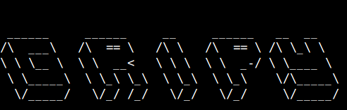

### Commands and flags ###

```
Flag options:
			--format/-f  | This will set the file format, which will be the file extension you are dorking for, for example (*.pdf)
						  This FLAG MUST HAVE THE PREFIX *. BEFORE THE EXTENSION THIS IS REQUIRED
				
			--verbose/-v | This sets verbosity to true or false, do you want large output if so use it if not dont

			
			--output/-o  | This will set the output directory of all downloaded files this is REQUIRED

			
			--query/-q   | This will set the google dorking query, this is REQUIRED

			
			--results/-r | This will set the amount of results per page, for example for every one page you want to output 5 links you would use --results=5


			--pages/-p   | This will set the amount of pages you want to search, for example if you want 100 pages use --pages=100

			--listp/-t   | This is an option if you want to use a list of queries, this would be the file to the query list / dork list

			--list/-l    | This is an option that NEEDS to be set BEFORE you use --listp example (--list --listp="filepath to dorks")
		

			==========================================================================================================================

			Example usage;

			Normal        1: 			go run main.go --format=(*.pdf) --verbose --output="/home/user/Desktop/File" --query="BTFM filetype:pdf" 
			File of dorks 2:            go run main.go --format=(*.doc) --verbose --output="/home/user/Desktop/File" --list --listp="/home/fileofdorks.txt"
			Results       3:            go run main.go --format=(*.pdf) --verbose --output="/home/user/Desktop/File" --query="BTFM filetype:pdf" --results=900 --pages=1000

```
